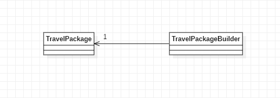

# Padrões de Projeto

## 1. Padrões de Criação:
___
### 1.4 Singleton

#### 1.4.1 Introdução
O Builder é um padrão de projeto criacional que permite a você construir objetos complexos passo a passo. O padrão permite que você produza diferentes tipos e representações de um objeto usando o mesmo código de construção.
#### 1.4.2 Exemplo abordado

Como exemplo para este padrão abordei o tema de um agência de viagens a qual de dispões de pacotes de viagens. A qual foi a classe implementada para o projeto.

#### 1.4.3 Diagrama de Classe do Exemplo

